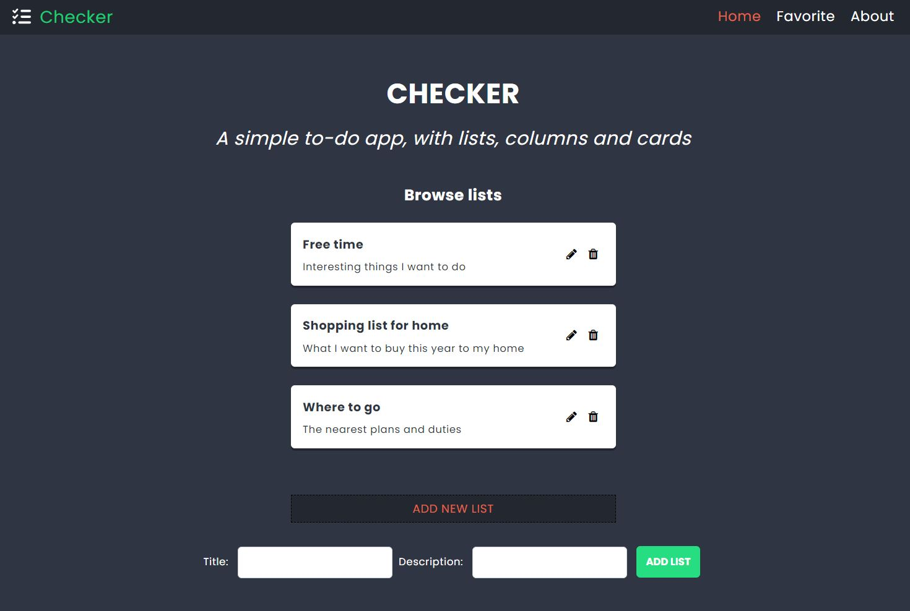
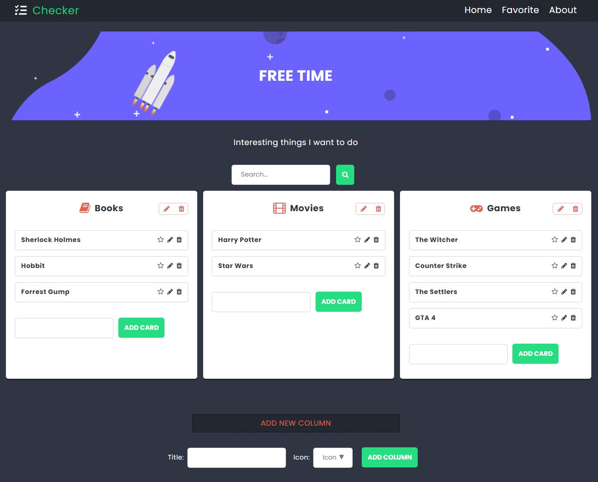
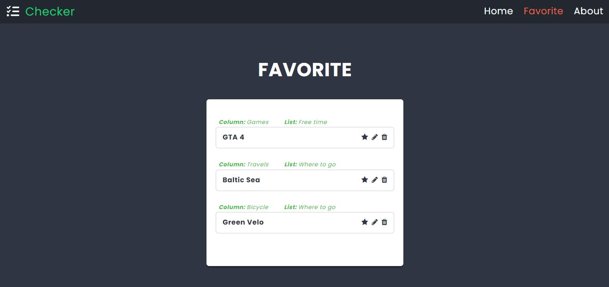
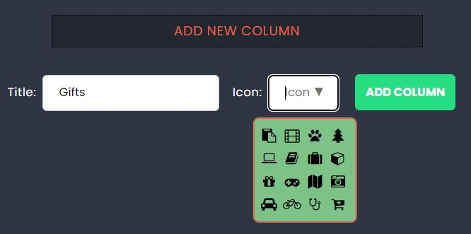

# Checker (simple-to-do-app)

A simple app designed for managing reminders involving important tasks, events, or plans. Users can utilize a three-tiered system of organizing elements: lists, columns, and cards.

## [Demo (click)](https://simple-to-do-app-bpedryc83.replit.app/)

## Technologies

- HTML
- CSS/SCSS
- React
- Redux
- RWD

The application was made based on provided fundamental styles, including the graphic backdrop of the main banner. However, most of the styles were created by the author (Bartłomiej Pedryc). The entire code in React has been developed solely by the author.

This website app has been developed following Responsive Web Design (RWD).

## Screenshots

## Lists
  
  
## Columns and cards  
  
 
## Favorite cards
  

## Icons available for columns
  